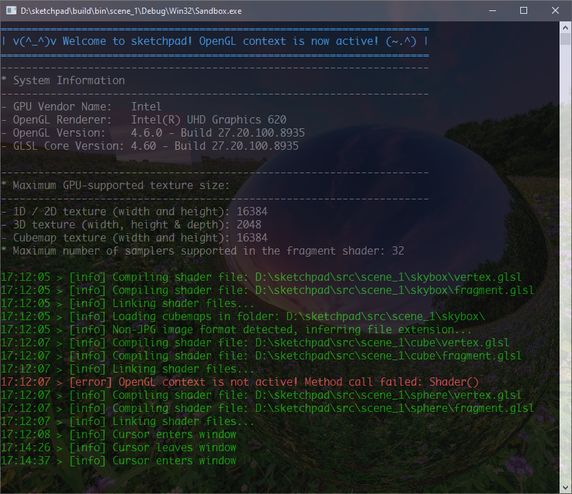

# WIP
# sketchpad (Windows 10)


<!-- ](https://github.com/neo-mashiro/sketchpad)
](https://github.com/neo-mashiro/sketchpad) -->

A simple canvas for testing out various topics and rendering techniques in computer graphics using the OpenGL rendering pipeline. This framework was built to quickly test some low-level graphics features and to learn how they work in OpenGL. Future versions may consider using the [SPIR-V](https://www.khronos.org/spir/) open source ecosystem to support Vulkan or OpenCL.

从零开始手写的一个OpenGL练习框架，用于实现GAMES202中的作业内容和其他一些有趣的东西。

I've always wanted to make an OpenGL sandbox to help me quickly prototype some sample scenes.
Although some design of this project is very much like a game engine, it is not, there's no batch rendering system, no physics, no collision detection, native scripting support, and users are expected to make new scenes from c++ code by using some exposed APIs, rather than relying on a bunch of clicks and drags via the editor UI like in a real game engine. In this project, UI is not part of the application, but is owned by each individual scene.
I'd rather think of it as being a "scene" engine, in the sense that it helps create a factory of scenes without the need to use low-level gl calls. Each scene is used to play with some shaders, the creation of scenes is kind of like Unity. Scenes, where the focus should be on rendering, not physics, not gameplay, the focus should be on underlying techniques, not the graphics API.

## Features

- Forward+ Rendering (a.k.a Tiled Forward Rendering)
- Deferred Rendering
- Physically-Based Rendering
- Path Tracing
- Real-time Ray Tracing (Monte-Carlo Integration)
- Normal Mapping without Precomputed Tangent Space Vectors

## Requirement

- Windows 10 + OpenGL version #460 or higher
- a desktop monitor with at least 1600 x 900 resolution (full HD or QHD is preferred)
- a dedicated graphics card which supports >= 1 samples per pixel (for raytracing)

## Dependencies

- [Premake5](https://github.com/premake/premake-core), [Visual Studio 2019](https://visualstudio.microsoft.com/downloads/) + optional extensions: [GLSL Language Integration](https://marketplace.visualstudio.com/items?itemName=DanielScherzer.GLSL) and [Visual Assist](https://www.wholetomato.com/)
- [GLEW](https://en.wikipedia.org/wiki/OpenGL_Extension_Wrangler_Library) (version 2.1.0), or better [GLAD](https://glad.dav1d.de/), and [GLM](https://glm.g-truc.net/0.9.2/api/index.html) (version 0.9.2 or above)
- [FreeGLUT](https://en.wikipedia.org/wiki/FreeGLUT) (v3.0.0 MSVC Package), or [GLFW](https://en.wikipedia.org/wiki/GLFW) (version 3.3.2) for finer control
- [stb](https://github.com/nothings/stb) (image loader), or better [SOIL](https://github.com/littlstar/soil), [SOIL2](https://github.com/SpartanJ/SOIL2) for more image utilities, and [spdlog](https://github.com/gabime/spdlog) (logging library)
- [EnTT](...) for entity-component system.
- [Assimp](https://github.com/assimp/assimp) (use [vcpkg](https://github.com/microsoft/vcpkg) to compile from sources)
```bash
git clone https://github.com/Microsoft/vcpkg.git
cd vcpkg
./bootstrap-vcpkg.sh
./vcpkg integrate install
./vcpkg.exe install assimp              # x86 build
./vcpkg.exe install assimp:x64-windows  # x64 build
```
- [Dear ImGui] HUI
- [xxx] Serialization

## How to build

The Premake Lua scripts will handle the workspace/project/build settings for all configurations and platforms for us, there's no need to set things up in Visual Studio by hand. To build the solution, simply run
```bash
git clone https://github.com/neo-mashiro/sketchpad.git
cd sketchpad/
vendor/premake/premake5.exe vs2019
```
Once you have cloned the repository, the `vendor` folder already contains the pre-compiled binaries of all dependencies listed above, simply open the solution in Visual Studio and fire up the application. The executables are then built into the `bin` folder for each platform (x86 or x64), and all dependent DLLs will be copied over there automatically so you don't need any extra setup.

## How to use

To make a new scene, just create a new `.h` and `.cpp` file in the [examples]() folder and start coding. You can reference the existing sample scenes to get a sense of how to use the API. GLSL shader sources, on the other hand, should be placed into the [res/shader/]() folder where you can find all the shaders used in the sample scenes, there's also a sample shader to walk you through the convention of our GLSL coding standard. The architecture of this application was designed such that only a minimal amount of work is necessary in your scene script, all of the examples will help you understand how to make a nice scene within 100 lines of code!

## Mouse and keyboard control

- on application startup, cursor is locked into the window and set to invisible.
- move the mouse to look around the scene from a first-person perspective.
- scroll up/down the mouse wheel to zoom in or zoom out the main camera.
- use directional keys or `wasd` to walk around the scene, use `space` and `z` to go up and down.
- press `enter` to open the menu (cursor enabled), where you can control GUI buttons, slidebars, etc.
- press `esc` to pop up the exit message box, click ok to confirm exit or cancel to resume.

## Sample scenes

<p align="center">
  <b>CONSOLE LOGS</b>
  <br><br>
  
</p>

<p align="center">
  <b>3D MESHES, TEXTURE MAPPING</b>
  <br><br>
  
</p>

<p align="center">
  <b>SKYBOX, REFLECTION MAPPING</b>
  <br><br>
  
</p>

<p align="center">
  <b>MODEL LOADING, BLINN-PHONG SHADING</b>
  <br><br>
  
</p>

## Useful References

- [Physically Based Rendering: From Theory To Implementation](https://www.pbr-book.org/)
- [Learn OpenGL](https://learnopengl.com)
- [Hazel Game Engine Series, The Cherno](....)
- [OpenGL 4 Shading Language Cookbook, Third Edition](...)
- GAMES202 - [Advanced Real-time Rendering](https://sites.cs.ucsb.edu/~lingqi/teaching/games202.html)
- CMU 15-462 - [course home](http://15462.courses.cs.cmu.edu/fall2020/home), [video lectures](https://www.youtube.com/playlist?list=PL9_jI1bdZmz2emSh0UQ5iOdT2xRHFHL7E)
- [Khronos OpenGL Wiki](https://www.khronos.org/opengl/wiki/Main_Page)
- [OpenGL API Documentation](http://docs.gl/)
- [Learning Modern 3D Graphics Programming](https://paroj.github.io/gltut/)
- [Anton's OpenGL 4 Tutorials](https://antongerdelan.net/opengl/)
- [GLSL v4.60 Specification](https://github.com/neo-mashiro/sketchpad/blob/main/res/GLSL%20v4.60%20Spec.pdf)

- Equirectangular [@flickr](https://www.flickr.com/groups/equirectangular/pool/)

## Recommended Reading

// forward+ rendering
https://www.3dgep.com/forward-plus/
https://takahiroharada.files.wordpress.com/2015/04/forward_plus.pdf
https://github.com/bcrusco/Forward-Plus-Renderer


## Acknowledgements

I would like to express my gratitude to Yu Meng.
My deepest gratitude goes first and foremost to Professor Zhou Yanxia, my supervisor, for his constant encouragement and guidance. He has walked me through all the stages of the writing of this thesis. Without his consistent and illuminating instruction, this thesis could not have reached its present form.
