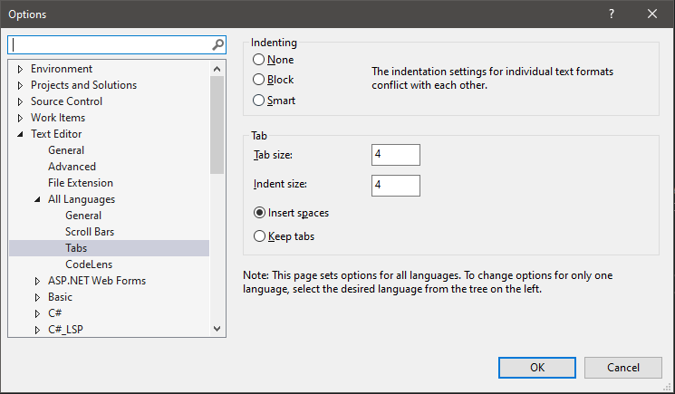
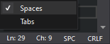

# sketchpad (Windows 10)

A simple canvas for testing out various topics and rendering techniques in computer graphics using the OpenGL rendering pipeline. This framework was built to quickly test some low-level graphics features and to learn how they work in OpenGL. Future versions may consider using the [SPIR-V](https://www.khronos.org/spir/) open source ecosystem to support Vulkan or OpenCL.

## Dependencies

- [Premake5](https://github.com/premake/premake-core), [Visual Studio 2019](https://visualstudio.microsoft.com/downloads/) + optional extensions: [GLSL Language Integration](https://marketplace.visualstudio.com/items?itemName=DanielScherzer.GLSL) and [Visual Assist](https://www.wholetomato.com/)
- [GLEW](https://en.wikipedia.org/wiki/OpenGL_Extension_Wrangler_Library) (version 2.1.0), or better [GLAD](https://glad.dav1d.de/), and [GLM](https://glm.g-truc.net/0.9.2/api/index.html) (version 0.9.2 or above)
- [FreeGLUT](https://en.wikipedia.org/wiki/FreeGLUT) (v3.0.0 MSVC Package), or [GLFW](https://en.wikipedia.org/wiki/GLFW) (version 3.3.2) for finer control
- [stb](https://github.com/nothings/stb) (image loader), or better [SOIL](https://github.com/littlstar/soil), [SOIL2](https://github.com/SpartanJ/SOIL2) for more image utilities, and [spdlog](https://github.com/gabime/spdlog) (logging library)
- [Assimp](https://github.com/assimp/assimp) (pre-compiled libraries not cross-platform, use [vcpkg](https://github.com/microsoft/vcpkg) to compile from source code)
```bash
git clone https://github.com/Microsoft/vcpkg.git
cd vcpkg
./bootstrap-vcpkg.sh
./vcpkg integrate install
./vcpkg.exe install assimp              # x86 build
./vcpkg.exe install assimp:x64-windows  # x64 build
```

## How to build

The Premake Lua scripts will handle the workspace/project/build settings for all configurations and platforms for us, there's no need to set things up in Visual Studio by hand. To build the application, simply run
```bash
git clone https://github.com/neo-mashiro/sketchpad.git
cd sketchpad/
vendor/premake/premake5.exe vs2019
```
As an aside, it is recommended to use spaces everywhere instead of tabs. In case the **tab size** of the editor and the website rendering the source code do not meet, indentation can be very messy. For example, there are so many hard-to-read repos on Github that use inconsistent indentation in the same file, because they are mixing four spaces with two tabs (of size 2) in the IDE, which is then converted to eight spaces on Github...





## How to build a scene

- (WIP) add screenshot: select startup project in the solution's properties window
- (WIP) add screenshot: keyboard controls, message boxes, mouse controls, motions, etc.

## Scenes

- scene1 name (come up with a name for each scene): detailed description (summarize the model, theory and techniques applied in this scene and what to expect)
- scene2 name

## Useful References

- CMU 15-462/662: [Course Home](http://15462.courses.cs.cmu.edu/fall2020/home), [Video Lectures](https://www.youtube.com/playlist?list=PL9_jI1bdZmz2emSh0UQ5iOdT2xRHFHL7E)
- [Khronos OpenGL Wiki](https://www.khronos.org/opengl/wiki/Main_Page)
- [OpenGL API Documentation](http://docs.gl/)
- [Learn OpenGL](https://learnopengl.com)
- [OpenGL Video Series, The Cherno](https://www.youtube.com/playlist?list=PLlrATfBNZ98foTJPJ_Ev03o2oq3-GGOS2)
- [Learning Modern 3D Graphics Programming](https://paroj.github.io/gltut/)
- [Anton's OpenGL 4 Tutorials](https://antongerdelan.net/opengl/)
- [GLSL v4.60 Specification](https://github.com/neo-mashiro/sketchpad/blob/main/res/GLSL%20v4.60%20Spec.pdf)
